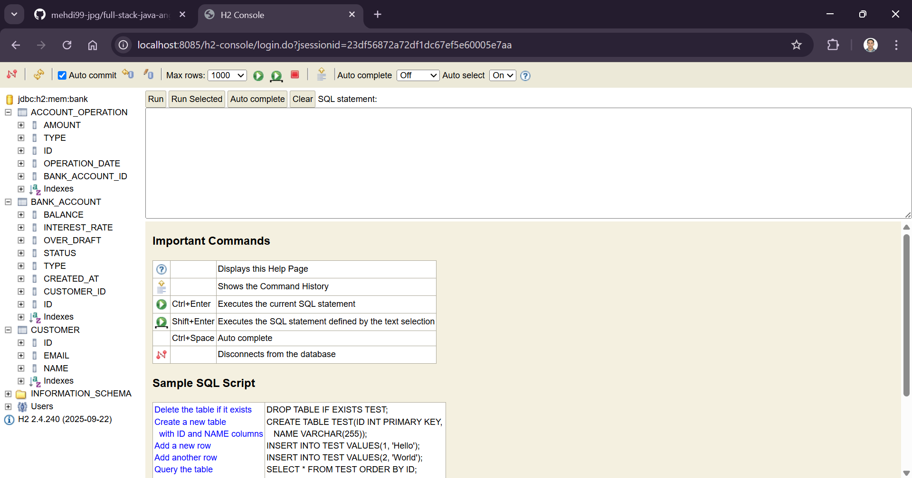
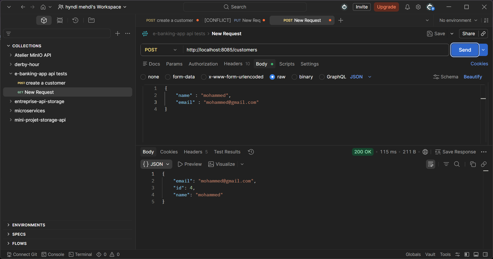
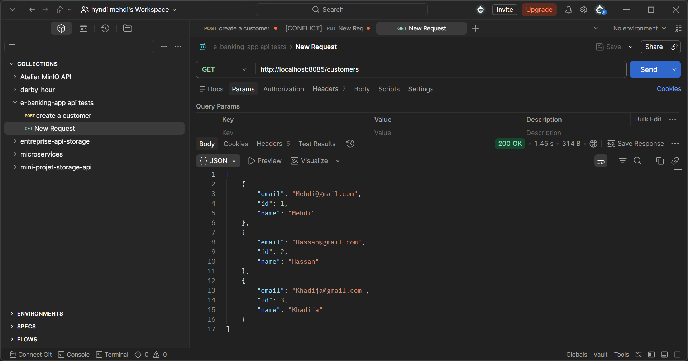
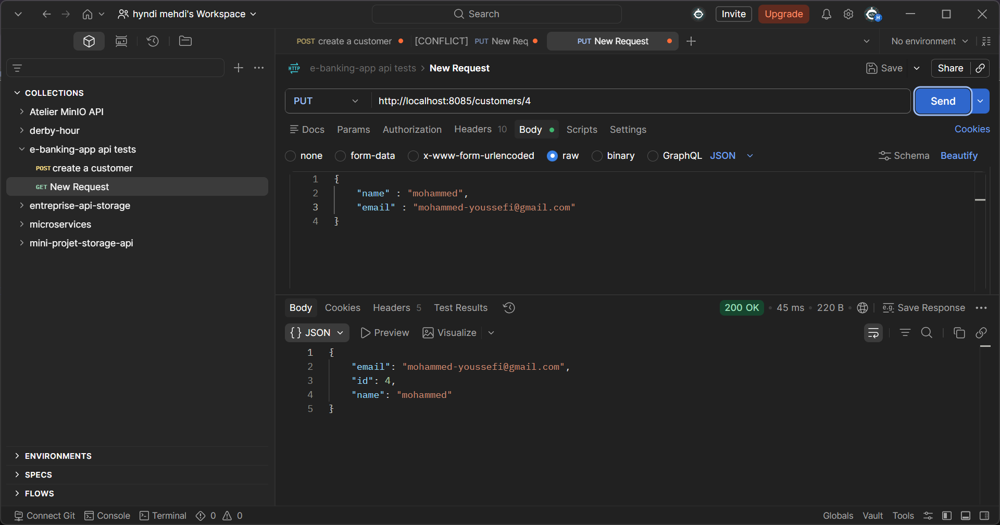
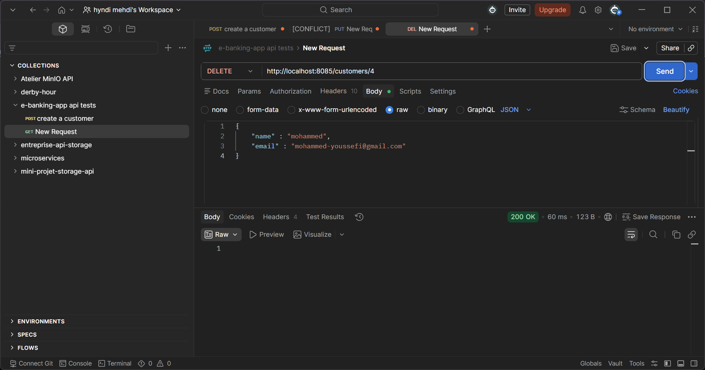
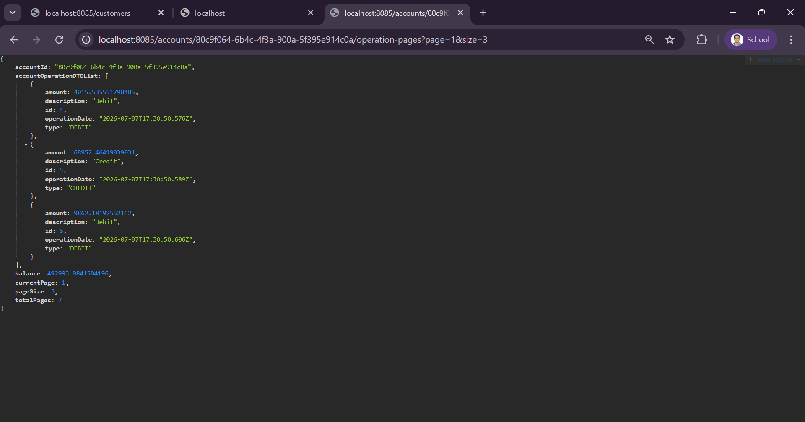
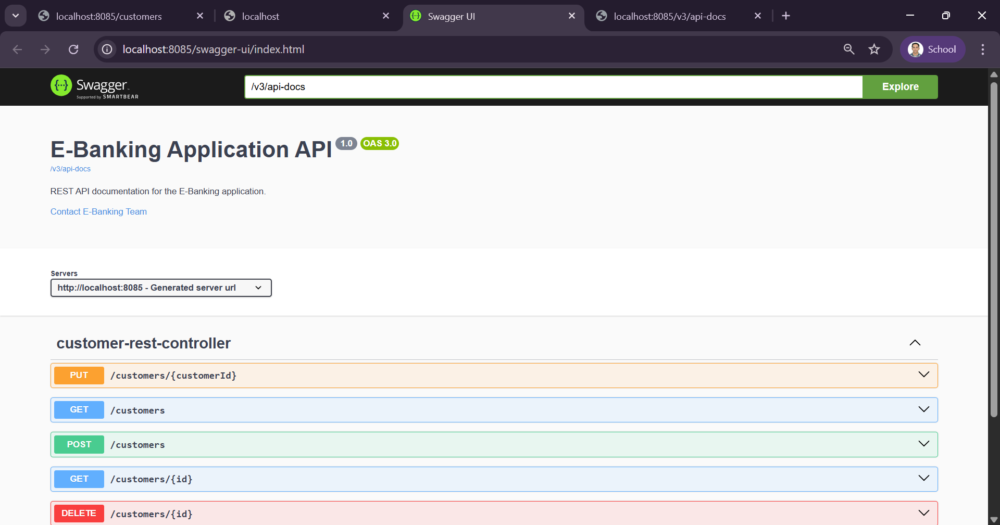

# E-Banking Application Backend

## Developer
HYNDI ELMEHDI

## Overview
This is a full-stack Spring Boot and JPA enterprise backend designed to manage banking operations, customers, and bank accounts. The application handles current accounts (with over-draft limits) and savings accounts (with interest rates), as well as logging debits, credits, and money transfer transactions.

The frontend interface corresponding to this backend is available in the following GitHub repository:
https://github.com/mehdi99-jpg/e-banking-app-angular

---

## Architecture and Workflow

The application follows a standard layered enterprise architecture:
1. **Presentation Layer (REST Controllers)**: Exposes endpoints for managing customers, bank accounts, and executing transactions.
2. **Security Layer (Spring Security & JWT)**: Intercepts incoming requests to validate JSON Web Tokens (JWT) for authentication and role-based authorization.
3. **AI Chatbot Layer (Spring AI & Groq)**: Integrates with the Groq API using an OpenAI-compatible client, exposing an endpoint that processes client messages and executes database queries dynamically via tool callbacks.
4. **Service Layer (Business Logic)**: Coordinates transactional operations, implements business rules (such as checking if a customer has a sufficient balance before a debit), and maps entities to Data Transfer Objects (DTOs) for secure and efficient serialization.
5. **Repository Layer (DAO)**: Interfaces with the database using Spring Data JPA.
6. **Entity Layer (Database Mappings)**: Defines the persistence model mapped to H2 Database tables.

### Inheritance Mapping Strategy
The application manages two types of accounts: CurrentAccount and SavingAccount. Both inherit from the abstract class BankAccount. This is mapped in the database using a Single Table Inheritance (InheritanceType.SINGLE_TABLE) strategy:
* A single table named bank_account stores all account information.
* A discriminator column (TYPE) distinguishes whether an account is a Current Account (CA) or a Savings Account (SA).
* Relationships are mapped so that each account belongs to a Customer and contains a collection of AccountOperation records representing transactions.

---

## Database Schema

At startup, Hibernate automatically generates the database schema in the in-memory H2 database based on the JPA entities.



---

## Features and Implementations

### 1. Security & Authentication (Spring Security & JWT)
A stateless security system has been integrated using Spring Security and JWT.
* **Token Authentication**: Users authenticate via the login endpoint to receive a JWT containing their scopes and roles.
* **Role-Based Authorization**: Restricts access to sensitive banking endpoints based on user scopes (such as SCOPE_ROLE_USER and SCOPE_ROLE_ADMIN).
* **CORS Policy Configuration**: Configured CORS filters to securely allow credentials and requests from the Angular frontend domain.

### 2. AI-Powered Banking Chatbot (Spring AI & Groq)
An interactive banking chatbot service has been added to assist users with database queries.
* **Groq Cloud Integration**: Utilizes Groq's high-speed Llama-3.3-70b-versatile model to power natural language processing.
* **AI Tool Callback System**: The model has access to local database functions through custom Java tools. It can list customers, retrieve specific account balances, and view transaction histories.
* **Circular Reference Mitigation**: Tool outputs map JPA entities into flattened Map structures to prevent Jackson serialization infinite loops caused by bi-directional relationships.
* **Tool Calling Parsing Fix**: System prompts explicitly enforce standard Llama-3 XML formatting tags (<function=name>{args}</function>) to bypass API gateway validation bugs on Groq.

### 3. Customer Management (CRUD)
Exposes complete REST endpoints to manage customer profiles:
* **Create Customer**: POST /customers
* **Read Customers**: GET /customers and GET /customers/{id}
* **Update Customer**: PUT /customers/{customerId}
* **Delete Customer**: DELETE /customers/{id}

#### Customer Operations in Postman:
* **Creating a Customer**:


* **Retrieving All Customers**:


* **Updating a Customer**:


* **Deleting a Customer**:


---

### 4. Bank Account Management
Exposes REST endpoints to fetch bank accounts:
* **Get Account Details**: GET /accounts/{accountId} (returns a Current or Savings Account DTO depending on the type)
* **List All Accounts**: GET /accounts

---

### 5. Transaction Operations
Implements core transactional operations:
* **Debit**: POST /accounts/debit (Subtracts an amount from the account balance and records a DEBIT transaction. It performs a business validation check to ensure the balance is sufficient).
* **Credit**: POST /accounts/credit (Adds an amount to the account balance and records a CREDIT transaction).
* **Transfer (Virement)**: POST /accounts/transfer (Executes a debit on the source account and a credit on the destination account within a single transaction).

---

### 6. Account Operations History & Pagination
To avoid returning large volumes of transaction data at once, the history endpoint implements server-side pagination:
* **Endpoint**: GET /accounts/{accountId}/operation-pages?page={page}&size={size}
* Returns an AccountHistoryDTO containing the current page index, total pages, page size, account balance, and the list of paginated AccountOperationDTO items.



---

### 7. API Documentation (Swagger / OpenAPI)
Integrated springdoc-openapi to automatically inspect controllers and generate interactive documentation.
* **Swagger UI Endpoint**: http://localhost:8085/swagger-ui/index.html
* **OpenAPI Specs (JSON)**: http://localhost:8085/v3/api-docs

#### Swagger Interface:


---

## Development and Execution Guide

### Prerequisites
* Java Development Kit (JDK 17 or higher)
* Maven 3.x
* Groq API Key (starts with gsk_...)

### Getting Started

1. **Configure Environment Properties**:
   Open `src/main/resources/application.properties` and configure your credentials:
   ```properties
   spring.ai.openai.api-key=YOUR_GROQ_API_KEY
   spring.ai.openai.base-url=https://api.groq.com/openai
   spring.ai.openai.chat.options.model=llama-3.3-70b-versatile
   ```

2. **Build the Application**:
   ```bash
   mvn clean package -DskipTests
   ```

3. **Run the Server**:
   ```bash
   mvn spring-boot:run
   ```
   The backend service starts on port 8085.
